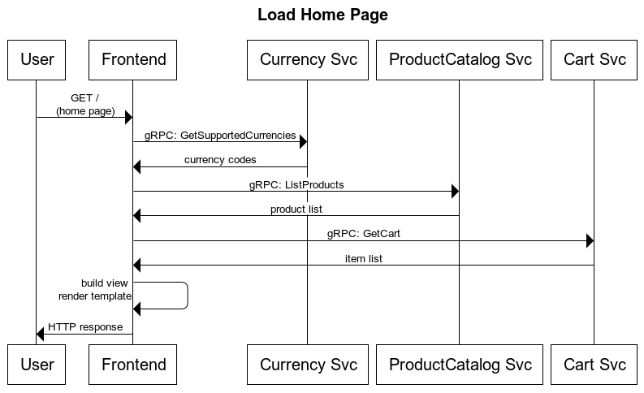

# User Journey: Load Home Page

User navigates to the home page to visualize catalog.

## Service Level Indicators

### SLI : Home page available

**Type**: Availability

**Specification**: Proportion of `home page requests (GET /)` that were served with `response code 2XX, 3XX or 4XX (excl. 429)` measured at the `load balancer`.

**Possible Implementations**
* Load Balancer (Istio Ingress gateway)
    - pros
        - information readily available
    - cons
        - does not capture failures on load balancer
        - requires istio configuration (not the default)
* FE Container logs
    - pros:
        - logs readily available
    - cons:
        - does not capture failure in the FE service
        - does not capture failures on load balancer
        - requires a log metric
* FE Custom Metric (OpenCensus)  => _choosen implementation_
    - pros:
        - custom metric available
        - default installation
    - cons:
        - does not capture failure in the FE service
        - does not capture failures on load balancer

**Good events**: HTTP response code for GET / is 2XX, 3XX or 4XX (excl. 429)

**Valid events**: All requests to GET /

**SLO**: 99.5% of requests served with good events in the past 28 days

### SLI : Home page latency

**Type**: Latency

**Specification**: Proportion of `home page requests (GET /)` that were served within 500ms measured at the `load balancer`.

**Possible Implementations**
* Load Balancer (Istio Ingress gateway)
    - pros
        - information readily available
    - cons
        - does not capture failures on load balancer
        - requires istio configuration (not the default)
* FE Container logs
    - pros:
        - logs readily available
    - cons:
        - does not capture failure in the FE service
        - does not capture failures on load balancer
        - requires a log metric
* FE Custom Metric (OpenCensus)
    - pros:
        - custom metric available
        - default installation
    - cons:
        - does not capture failure in the FE service
        - does not capture failures on load balancer

**Good events**: GET / faster than 500ms

**Valid events**: All requests to GET /

**SLO**: 99% of requests served with good events in the past 28 days
