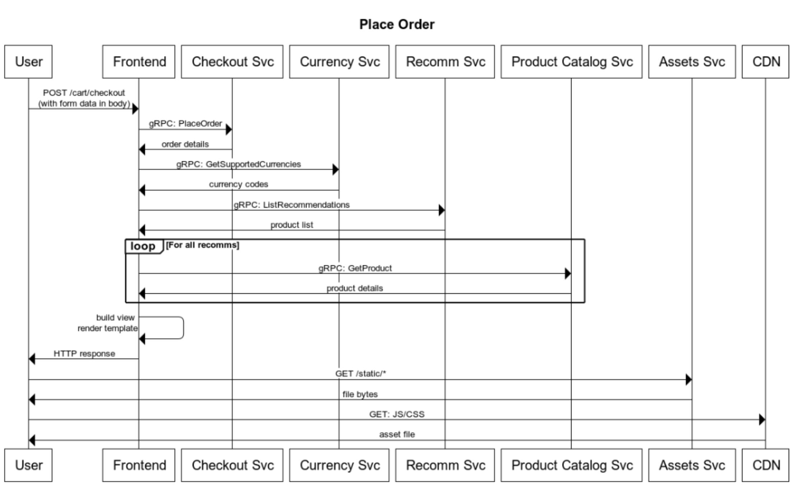

# User Journey: Place Order

User checks out all items in the cart, placing a purchase order.

 

## **Assumptions**

* You must have items in the cart to be able to place an order.

---

 

## **Service Level Indicators**

### SLI : Place order available

**Type**: Availability

**Specification**: Proportion of all requests for cart checkout that returned successfully

**Valid events**

- All `POST /cart/checkout` requests

**Good events**

- Response status 2xx, 3xx and 4xx excl. 429

**Implementation**
* **Measured at frontend service logs (ingress gateway)**
    - pros
        - Cheap and easy
        - Centralized gateway
        - Closest to the customer within infrastructure
        - Allow for evolving filters and further analysis
    - cons
        - frontend issues affects measurement

* **Measured at syntectic client**
    - pros
        - Identifies frontend incidents
    - cons
        - Engineering maintenance
        - Misses specific issues on different products
        - Misses issues impact measurement on different users

* **Measured at client with telemetry**
    - pros
        - Closest to a real-user experience
    - cons
        - Needs consent
        - External factors may impact
        - Malicious behaviour / telemetry hacking

**Specification**: Proportion of all `POST /cart/checkout` requests that returned status `2xx, 3xx and 4xx excl. 429` measured at the `ingress gateway`.

**SLO**: 99.9% in a 28-day window

 

---

 

### SLI : Place order happening quickly

**Type**: Latency

**Specification**: Proportion of all requests for cart checkout that returned under X ms

**Valid events**

- All `POST /cart/checkout` requests

**Good events**

- Responses in under `2100ms`

    **Analysis:**

    - PlaceORder =~ `1000ms`
    - GetProduct: `150ms` x 5 =~ `750ms`
    - GetSupportedCurrencies =~ `50ms`
    - ListRecommendations =~ `150ms`

**Implementation**
* **Measured at frontend service logs (ingress gateway)**
    - pros
        - Cheap and easy
        - Precise backend-related latency
        - Centralized gateway
        - Allow for evolving filters and further analysis
    - cons
        - frontend issues affects measurement

* **Measured at syntectic client**
    - pros
        - Identifies frontend incidents
        - Covers latency for ground between frontend and client
    - cons
        - Engineering maintenance
        - Misses specific issues on different products
        - Misses issues impact measurement on different users

* **Measured at client with telemetry**
    - pros
        - Closest to a real-user experience
    - cons
        - Needs consent
        - External factors may drastically impact and generate noise
        - Malicious behaviour / telemetry hacking

**Specification**: Proportion of all `POST /cart/checkout` requests returned under `2100 ms` measured at the `ingress gateway`.

**SLO**: 98% in a 28-day window

 

---

 

### SLI : Place order results must generate confirmation and tracking numbers

**Type**: Quality

**Specification**: Proportion of all requests for cart checkout that generated confirmation and tracking numbers correctly

**Example**
- Confirmation #: a719b1c0-f702-11ec-a9a2-d238a9c5ee31
- Tracking #: DX-44331-224713831

**Implementation**
* **Measured at frontend service logs (ingress gateway)**
    - pros
        - Cheap and easy
        - Precise backend-related latency
        - Centralized gateway
        - Allow for evolving filters and further analysis
    - cons
        - frontend issues affects measurement
        - **Can't inspect necessary fields**

* **Measured at syntectic client**
    - pros
        - Identifies frontend incidents
        - Covers latency for ground between frontend and client
    - cons
        - Engineering maintenance
        - Misses specific issues on different orders

* **Measured at client with telemetry**
    - pros
        - Closest to a real-user experience
    - cons
        - Needs consent
        - External factors may drastically impact and generate noise
        - Malicious behaviour / telemetry hacking
        - **Should not change behavior from user to user**

* **Measured at logs**
    - pros
        - Lots of logs and information to use
        - Can write complex queries/parsing to validate behavior
    - cons
        - Needs to be created manually (regex and join results)
        - May be slow due to processing time or logging aggregation strategy
        - Applications must not change log pattern to avoid breaking the metric

**Specification**: Proportion of `POST /cart/checkout` requests that `generated confirmation and tracking numbers` measured by searching and parsing application `logs`.

**SLO**: 99.99% in a 28-day window

 

---

 

### SLI : Place order results has correct total paid amount

**Type**: Quality

**Specification**: Proportion of all requests for cart checkout that contains correct total paid amount

**Implementation**
* **Measured at frontend service logs (ingress gateway)**
    - pros
        - Cheap and easy
        - Precise backend-related latency
        - Centralized gateway
        - Allow for evolving filters and further analysis
    - cons
        - frontend issues affects measurement
        - **Can't inspect necessary fields**
        - **May be hard to calculate amount again**

* **Measured at syntectic client**
    - pros
        - Identifies frontend incidents
        - Covers latency for ground between frontend and client
    - cons
        - Engineering maintenance
        - Misses specific issues on different orders

* **Measured at client with telemetry**
    - pros
        - Closest to a real-user experience
    - cons
        - Needs consent
        - External factors may drastically impact and generate noise
        - Malicious behaviour / telemetry hacking
        - **May be hard to calculate amount on client side**

* **Measured at logs**
    - pros
        - Lots of logs and information to use
        - Can write complex queries/parsing to validate behavior
    - cons
        - Needs to be created manually (regex and join results)
        - May be slow due to processing time or logging aggregation strategy
        - **May be hard to calculate amount again and may not make sense to log it**

**Specification**: Proportion of `POST /cart/checkout` requests that `returned correct total paid amount` measured by a `synthetic client every 5 minutes`.

**Example**: basically a call containing pre-defined products and currency and checked on returned HTML for the correct amount.

**SLO**: 99.9% in a 6-hour window