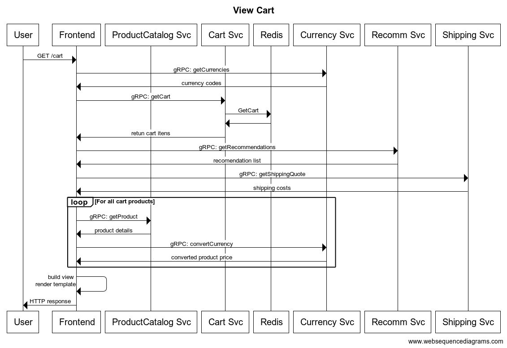

# User Journey: View Cart

User navigates to the view cart page to visualize products to potentially order.

 

## **Service Level Indicators**

### SLI : View cart availability

**Type**: Availability

**Specification**: Proportion of get cart requests (GET /cart) that were served with response code 2XX, 3XX or 4XX (excl. 429) measured at the ____________.

**Implementation**
* [Potential SLI implementation]
    - pros
    - cons
* [Another potential implementation]
    - pros
    - cons

**Good events**

- All `GET /cart` requests

**Valid events**

- Response status 2xx, 3xx and 4xx excl. 429

**SLO**: 99.5% of requests served with good events in the past 28 days

 

---

## **Service Level Indicators**

### SLI : View cart latancy

**Type**: Latency

**Specification**: Proportion of get cart requests (GET /cart) that were served within 500ms measured at the ____________.

**Implementation**
* [Potential SLI implementation]
    - pros
    - cons
* [Another potential implementation]
    - pros
    - cons

**Good events**

- All `GET /cart` requests

**Valid events**

- Served within 500ms

**SLO**: 99% of requests served with good events in the past 28 days

 
