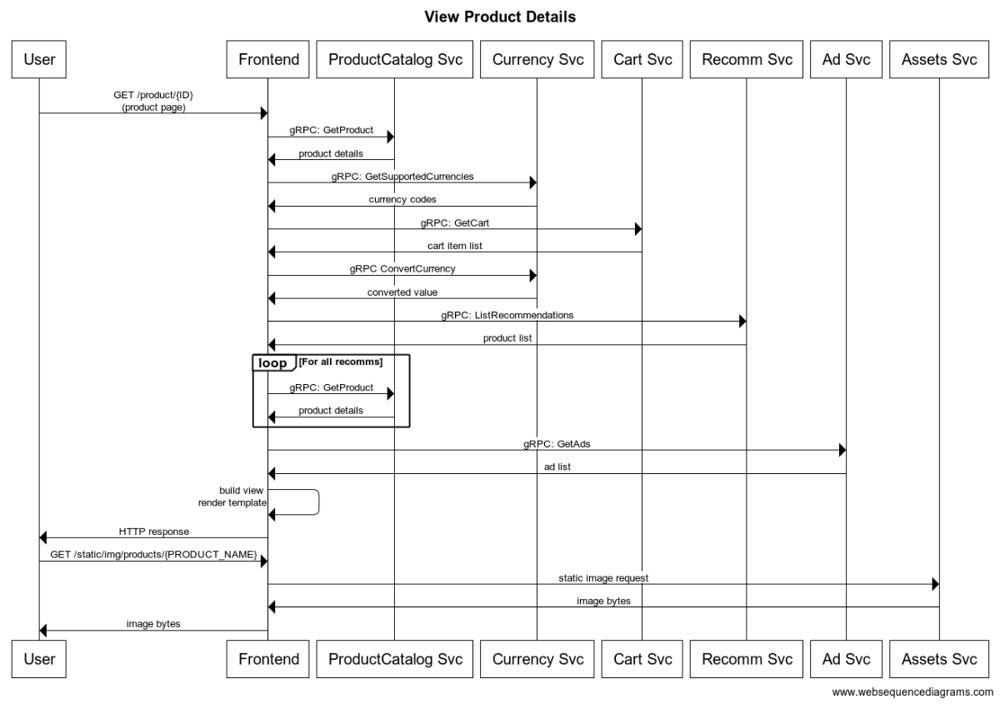

# User Journey: View Product Details

User chooses a listed product to visualize further details.

 

## **Assumptions**

* Chosen product (ID) is present and valid (`application returns 500 when product ID is not found` --> Reliability backlog)

 

---

 

## **Service Level Indicators**

### SLI : Product details available

**Type**: Availability

**Specification**: Proportion of all requests for product details that returned successfully

**Valid events**

- All `GET /product/{ID}` and `GET /static/img/products/{PRODUCT_NAME}` requests

**Good events**

- Response status 2xx, 3xx and 4xx excl. 429

**Implementation**
* **Measured at frontend service logs (ingress gateway)**
    - pros
        - Cheap and easy
        - Centralized gateway
        - Closest to the customer within infrastructure
        - Allow for evolving filters and further analysis
    - cons
        - frontend issues affects measurement

* **Measured at syntectic client**
    - pros
        - Identifies frontend incidents
    - cons
        - Engineering maintenance
        - Misses specific issues on different products
        - Misses issues impact measurement on different users

* **Measured at client with telemetry**
    - pros
        - Closest to a real-user experience
    - cons
        - Needs consent
        - External factors may impact
        - Malicious behaviour / telemetry hacking

**Specification**: Proportion of all `GET /product/{ID}` and `GET /static/img/products/{PRODUCT_NAME}` requests that returned status `2xx, 3xx and 4xx excl. 429` measured at the `ingress gateway`.

**SLO**: 99% in a 28-day window

 

---

 

### SLI : Product details displaying quickly

**Type**: Latency

**Specification**: Proportion of all requests for product details that returned under X ms

**Valid events**

- All `GET /product/{ID}` requests

**Good events**

- Responses in under `1500ms`

    **Analysis:**

    - GetProduct: `150ms` x 5 =~ `750ms`
    - GetSupportedCurrencies =~ `50ms`
    - GetCart =~ `100ms`
    - ConvertCurrency =~ `50ms`
    - GetRecommendations =~ `200ms`
    - GetAds =~ `100ms`

**Implementation**
* **Measured at frontend service logs (ingress gateway)**
    - pros
        - Cheap and easy
        - Precise backend-related latency
        - Centralized gateway
        - Allow for evolving filters and further analysis
    - cons
        - frontend issues affects measurement

* **Measured at syntectic client**
    - pros
        - Identifies frontend incidents
        - Covers latency for ground between frontend and client
    - cons
        - Engineering maintenance
        - Misses specific issues on different products
        - Misses issues impact measurement on different users

* **Measured at client with telemetry**
    - pros
        - Closest to a real-user experience
    - cons
        - Needs consent
        - External factors may drastically impact and generate noise
        - Malicious behaviour / telemetry hacking

**Specification**: Proportion of all `GET /product/{ID}` requests returned under `1500 ms` measured at the `ingress gateway`.

**SLO**: 98% in a 28-day window

 

---

 

### SLI : Product details images displaying quickly

**Type**: Latency

**Specification**: Proportion of all requests for product images that returned under X ms

**Assumptions**: All images are, in average, the same size (as enforced by server).

**Valid events**

- All `GET /static/img/products/{PRODUCT_NAME}` requests

**Good events**

- Responses in under `200ms`

**Implementation**
* **Measured at frontend service logs (ingress gateway)**
    - pros
        - Cheap and easy
        - Precise backend-related latency
        - Centralized gateway
        - Allow for evolving filters and further analysis
    - cons
        - frontend issues affects measurement

* **Measured at syntectic client**
    - pros
        - Identifies frontend incidents
        - Covers latency for ground between frontend and client
    - cons
        - Engineering maintenance
        - Misses specific issues on different products
        - Misses issues impact measurement on different users

* **Measured at client with telemetry**
    - pros
        - Closest to a real-user experience
        - May help us improve content for different connections speed (drop image size for better experience)
    - cons
        - Needs consent
        - External factors may drastically impact and generate noise
        - Malicious behaviour / telemetry hacking

**Specification**: Proportion of all `GET /static/img/products/{PRODUCT_NAME}` requests returned under `200 ms` measured at the `ingress gateway`.

**SLO**: 98% in a 28-day window

 

---

 

### SLI : Product details displaying correct product

**Type**: Quality

**Specification**: []

**Implementation**
* [Potential SLI implementation]
    - pros
    - cons
* [Another potential implementation]
    - pros
    - cons

**Good events**

**Valid events**

**SLO**: [Your SLO Specification]